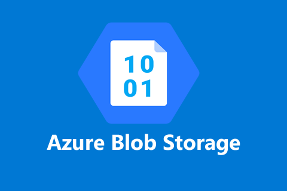
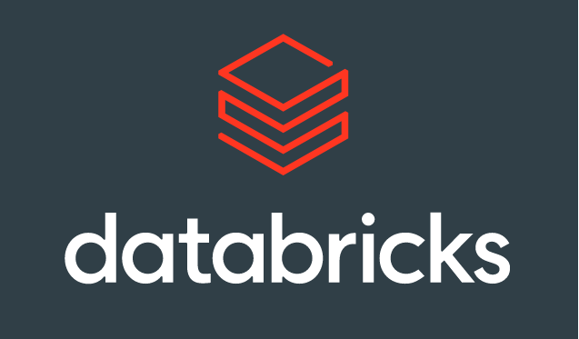

# Effects of covid on trade

## ETL pipeline 

### Data Storage:

- For the purprose of data storage we used a blob storage sanctioned via Azure cloud platform.

### Data Transformation

- For data transformation and loading to data base we used Azure databricks by running Pyspark queries in order to create the following fact and dimension tables.

- 1. Fact

- 2. Country

- 3. Commodity

- 4. Transport Mode

- 5. Direction

- 6. Measure

### Data loading

- For data loading and storage we use SQL server deployed in azure cloud

### Analytics Dashboard

By leveraging tabeleau's comprehensive dashboard creation utilities we are able to create a consolidated dashboard as shown in Book2.pdf

